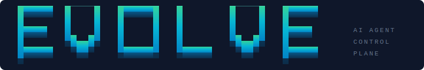
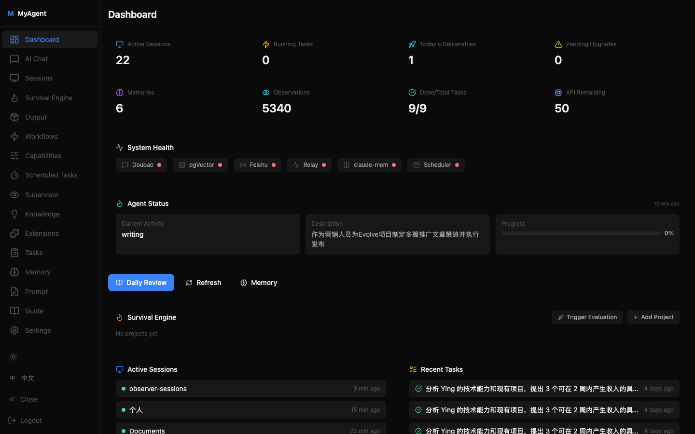
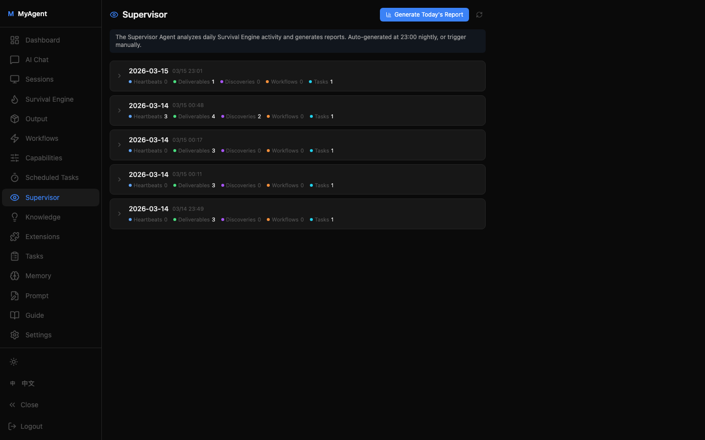
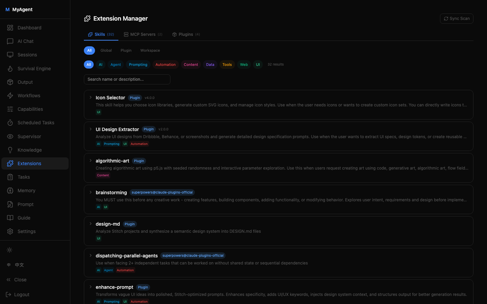
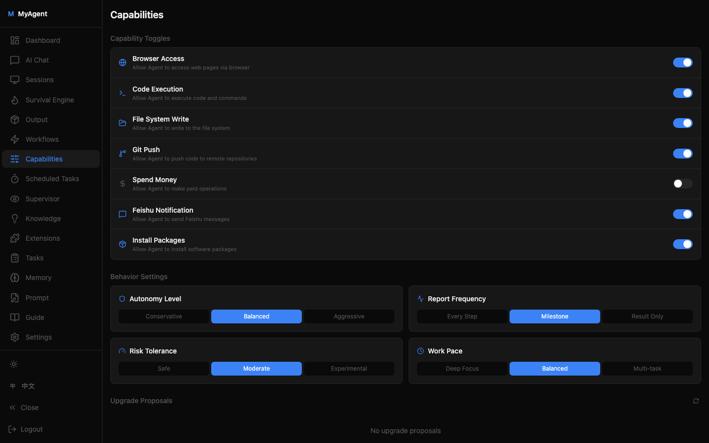

<p align="center">
  
</p>

<p align="center">
  <strong>The Control Plane for Autonomous AI Agents</strong><br/>
  <em>Self-managing. Self-learning. Self-evolving.</em>
</p>

<p align="center">
  <a href="#features">Features</a> •
  <a href="#architecture">Architecture</a> •
  <a href="#quick-start">Quick Start</a> •
  <a href="#api-reference">API</a> •
  <a href="README_CN.md">中文文档</a>
</p>

---

> Evolve is **not another agent framework**. It's a **control system** — it doesn't care how your agent writes code. It cares whether your agent is working, working correctly, learning from mistakes, and getting better over time.

<p align="center">
  
</p>

## Why Evolve?

When you run Claude/GPT autonomously 24/7, three problems emerge:

| Problem | Traditional Fix | Evolve's Approach |
|---------|----------------|-------------------|
| **No idea what Agent is doing** | Tail logs, watch terminal | Agent proactively reports (Self-Report API) |
| **Agent repeats the same mistakes** | Remind it manually every time | Auto-extract lessons → inject into prompt (Knowledge Hub) |
| **Agent does something dumb** | Discover it after the fact | A second AI reviews in real-time (Supervisor Agent) |

## Features

### 1. Agent Self-Report API

Traditional monitoring watches agents from the outside. Evolve flips this: **the agent must report its own status**.

```bash
# Agent says: "I'm coding, 40% done"
curl -X POST $MYAGENT_URL/api/agent/heartbeat \
  -d '{"activity":"coding","description":"implementing auth module","progress_pct":40}'

# Agent says: "I discovered something important"
curl -X POST $MYAGENT_URL/api/agent/discovery \
  -d '{"title":"Rate limit found","content":"Max 3 posts/day on XHS","priority":"high"}'

# Agent says: "Here's what I learned today"
curl -X POST $MYAGENT_URL/api/agent/review \
  -d '{"accomplished":["API integration"],"learned":["Use MD5 not SHA256 for signatures"]}'
```

**6 reporting endpoints:** Heartbeat | Deliverable | Discovery | Workflow | Upgrade Proposal | Review

No report = work doesn't exist. This rule is baked into the agent's prompt.

### 2. Knowledge Hub — Agents That Get Smarter

Most agent frameworks start from zero every conversation. Evolve solves this with a **closed-loop learning system**:

```
Agent makes a mistake (review.learned: "pkill -f crashes the system")
        │
        ▼ Real-time ingestion
   Doubao auto-evaluates: score 10/10 (critical lesson)
        │
        ▼ Layered storage
   ┌─────────────────────────────────────────────┐
   │  Permanent (≥8)  Core lessons, never expire  │
   │  Recent (5-7)    Useful but temporal, 30d TTL │
   │  Task            Matched to current plans     │
   └─────────────────────────────────────────────┘
        │
        ▼ Injected into prompt on next startup
   Agent never uses pkill -f again
```

**Key design decisions:**
- **Refinement, not storage.** A secondary LLM scores each lesson (1-10), distills it to one sentence, and tags it
- **Three-layer injection.** Only the most relevant knowledge enters the prompt — not everything
- **Auto-expiry.** Low-score knowledge expires after 30 days, keeping the knowledge base lean

### 3. Supervisor Agent — AI Reviewing AI

<p align="center">
  
</p>

One agent works. Another agent reviews its work.

Click "Analyze" → Evolve reads the survival engine's full JSONL conversation log → Python extracts key actions (tool calls, decisions, commands) → compresses to ~6000 chars → sends to Doubao for analysis:

- Was each decision reasonable?
- Any repeated operations, idle loops, or wasted effort?
- Did it follow instructions?
- Efficiency score + improvement suggestions

**Extremely low cost:** Doubao handles analysis, not Claude.

### 4. Survival Engine — 24/7 Persistent Agent

Not a one-shot script. A **continuously alive** agent:

- **Watchdog:** Health check every 10s, auto-revival on hang
- **Heartbeat detection:** 5min no heartbeat → gentle nudge, 15min → context-aware intervention
- **Crash recovery:** `--resume` restart with knowledge injection, seamless continuation
- **Web terminal:** Operate the tmux session directly from your browser

### 5. Skills-First Workflow

The agent is **required** to use structured skills before writing code:

```
New project? → /brainstorming → /writing-plans → /executing-plans
Bug found?   → /systematic-debugging
Done?        → /verification-before-completion
```

Before starting any task, the agent must:
1. Run `/skills` to check available capabilities
2. Search for better tools, MCP servers, or skills that could help
3. Install and register new tools via the Discovery API

**No cowboy coding.** Design first, then execute.

### 6. Extensions Management

Full visibility into what your agent has installed:

<p align="center">
  
</p>

- **Skills scanner** — discovers skills from global (`~/.claude/skills/`), plugins, and workspace projects
- **MCP servers** — shows all connected Model Context Protocol servers
- **Plugins** — lists installed Claude Code plugins with enable/disable status
- **Tagging system** — auto-inferred tags (AI, Web, Tools, Data, etc.) with manual override
- **Source tracking** — marks which extensions were installed by the survival engine vs. manually

### 7. Capability Controls

Toggle agent permissions at runtime from the Dashboard — no restart needed:

<p align="center">
  
</p>

| Capability | Status | Meaning |
|-----------|--------|---------|
| Browser access | Allowed | Agent can use Chrome for research |
| Git push | Allowed | Agent can push code to GitHub |
| Spend money | Blocked | Agent cannot purchase paid services |
| Install packages | Blocked | Agent cannot pip install / npm install |

### 8. Scheduled Tasks

The agent creates scheduled tasks via API. Evolve executes them automatically:

```bash
curl -X POST $MYAGENT_URL/api/scheduled-tasks \
  -d '{"name":"Daily publish","cron_expr":"0 9 * * *","command":"/path/to/script.sh"}'
```

croniter-based scheduler with stdout/stderr capture, timeout handling, and run history.

### 9. Internationalization

Full i18n support with **Chinese** and **English** — 450+ translation keys. Switch languages from the sidebar.

---

## Architecture

```
┌──────────────────────────────────────────────────────────────┐
│                        Web Dashboard                         │
│  Dashboard│Survival│Knowledge│Supervisor│Workflows│Extensions │
└────────────────────────────┬─────────────────────────────────┘
                             │ REST API
┌────────────────────────────┴─────────────────────────────────┐
│                     Evolve Server (FastAPI)                   │
│                                                              │
│  ┌─────────────┐  ┌──────────────┐  ┌─────────────────────┐ │
│  │ Self-Report  │  │  Knowledge   │  │   Supervisor Agent  │ │
│  │   6 APIs     │  │   Engine     │  │   (JSONL + Doubao)  │ │
│  └──────┬──────┘  └──────┬───────┘  └──────────┬──────────┘ │
│         │                │                      │            │
│  ┌──────┴────────────────┴──────────────────────┴──────────┐ │
│  │              SQLite (knowledge + extensions + ...)       │ │
│  └─────────────────────────────────────────────────────────┘ │
│                                                              │
│  ┌──────────────────────┐  ┌──────────────────────────────┐ │
│  │   Survival Engine    │  │     Cron Scheduler           │ │
│  │  (tmux + watchdog)   │  │  (croniter + shell exec)     │ │
│  └──────────┬───────────┘  └──────────────────────────────┘ │
└─────────────┼────────────────────────────────────────────────┘
              │ tmux
     ┌────────┴────────┐
     │  Claude Agent   │  ← Runs continuously, self-reports, self-decides
     └─────────────────┘
```

## Data Flow: The Learning Loop

```
Agent works ──→ Calls Self-Report API
                        │
            ┌───────────┼───────────┐
            ▼           ▼           ▼
        heartbeat   deliverable  review.learned
                                    │
                              ▼ Doubao refines
                         knowledge_base
                              │
                    ▼ Injected on next startup
                      Agent got smarter
```

## Tech Stack

| Layer | Technology |
|-------|-----------|
| Backend | Python 3.12+ / FastAPI / SQLite / aiosqlite |
| Frontend | React 19 + TypeScript + Vite + Tailwind CSS |
| Terminal | xterm.js + tmux |
| Agent Runtime | Claude Code (Survival Engine) |
| Analysis LLM | Doubao (knowledge refinement / supervisor analysis) |
| Notifications | Feishu Bot (optional) |
| i18n | react-i18next (zh-CN / en) |

## API Reference

### Self-Report API (Agent → Evolve)

| Endpoint | Method | Purpose |
|----------|--------|---------|
| `/api/agent/heartbeat` | POST | Activity heartbeat |
| `/api/agent/deliverable` | POST | Report deliverable |
| `/api/agent/discovery` | POST | Report discovery → auto-enters knowledge base |
| `/api/agent/review` | POST | Work review → `learned` auto-enters knowledge base |
| `/api/agent/workflow` | POST | Create reusable workflow |
| `/api/agent/upgrade` | POST | Submit capability upgrade proposal |

### Management API (Dashboard → Evolve)

| Endpoint | Method | Purpose |
|----------|--------|---------|
| `/api/knowledge` | GET/POST | Knowledge base CRUD |
| `/api/knowledge/{id}/promote` | POST | Promote to permanent layer |
| `/api/extensions` | GET | List skills, MCPs, plugins |
| `/api/extensions/sync` | POST | Scan filesystem and sync to DB |
| `/api/projects/scan` | GET | Scan workspace projects |
| `/api/supervisor/analyze` | POST | Trigger supervisor analysis |
| `/api/scheduled-tasks` | GET/POST | Scheduled task management |
| `/api/agent/prompt` | GET/PUT | Edit survival engine prompt |

## Quick Start

```bash
git clone https://github.com/xmqywx/Evolve.git
cd Evolve

# Backend
python -m venv .venv
.venv/bin/pip install -r requirements.txt

# Frontend
cd web && npm install && npm run build && cd ..

# Configure
cp config.yaml.example config.yaml
# Edit config.yaml with your API keys

# Run
.venv/bin/python run.py
# Visit http://localhost:3818
```

## Project Structure

```
myagent/
├── server.py          FastAPI server + all API endpoints
├── survival.py        Survival engine (tmux watchdog + dynamic prompt injection)
├── knowledge.py       Knowledge hub (ingest → refine → store → inject)
├── supervisor.py      Supervisor agent (JSONL extraction + Doubao analysis)
├── extensions.py      Extensions scanner (skills, MCPs, plugins)
├── cron_scheduler.py  Scheduled task scheduler (croniter + asyncio)
├── db.py              SQLite data layer (20+ tables)
├── doubao.py          Doubao API client
├── scanner.py         Claude session scanner + JSONL parser
├── feishu.py          Feishu notifications
└── config.py          Pydantic config models

web/src/
├── i18n/              Internationalization (zh-CN, en)
├── pages/
│   ├── Dashboard.tsx      Control panel (heartbeats, deliverables, discoveries)
│   ├── Survival.tsx       Survival engine terminal (web terminal + watchdog toggle)
│   ├── Knowledge.tsx      Knowledge base (filter, add, promote, delete)
│   ├── Supervisor.tsx     Supervisor reports (JSONL analysis)
│   ├── Extensions.tsx     Extensions manager (skills, MCPs, plugins with tags)
│   ├── Output.tsx         Deliverables + project overview
│   ├── Sessions.tsx       Multi-session management
│   ├── ScheduledTasks.tsx Scheduled task management
│   ├── Workflows.tsx      Workflow / skill library
│   ├── Capabilities.tsx   Capability toggle panel
│   ├── PromptEditor.tsx   Live prompt editor
│   └── ...
└── components/
    ├── IconSidebar.tsx    Expandable icon sidebar
    └── Layout.tsx         App layout
```

## The Harness Engineering Paradigm

Evolve is built on a concept we call **Harness Engineering** — the discipline of building infrastructure that wraps, constrains, and amplifies AI models. Instead of improving the model itself, you improve the system around it.

```
Traditional: Better Model → Better Results
Harness Eng: Same Model + Better Harness → Dramatically Better Results
```

Evolve implements five types of harness:

| Harness | What it does | Evolve component |
|---------|-------------|-----------------|
| **Prompt Harness** | Dynamically assembles the optimal prompt with context, knowledge, and constraints | Identity Prompt + Knowledge Injection |
| **Output Harness** | Captures, validates, and routes agent outputs to the right systems | Self-Report API + Knowledge Hub |
| **Constraint Harness** | Enforces boundaries and permissions at runtime | Capability Controls + Forbidden Operations |
| **Runtime Harness** | Keeps the agent alive, detects failures, recovers state | Survival Engine + Watchdog + Crash Recovery |
| **Observation Harness** | Monitors agent behavior and generates insights | Supervisor Agent + JSONL Analysis |

**Why this matters:** The model (Claude, GPT, etc.) is a commodity. The harness is your competitive advantage. Two teams using the same model will get wildly different results based on their harness quality.

**Future directions:**
- **Knowledge Distillation** — aggregate noisy discoveries into weekly intelligence briefings, not raw lists
- **Intent Marketplace** — decompose high-level goals into tradeable sub-intents that multiple agents can bid on

---

## Comparison

| | Evolve | Hermes Agent | AutoGPT | CrewAI |
|---|---|---|---|---|
| Purpose | Agent control plane | Agent framework | Autonomous agent | Multi-agent orchestration |
| Self-reporting | 6 APIs | None | None | None |
| Knowledge loop | Auto-refine + inject | Manual skill files | None | None |
| AI reviews AI | Supervisor agent | None | None | None |
| Skills-first workflow | Enforced | None | None | None |
| Runtime capability control | Dashboard toggles | None | None | None |
| 24/7 watchdog | Heartbeat + nudge | None | None | None |
| Extension management | Scan + tag + track | None | None | None |
| Web dashboard | Full-featured | CLI only | Web UI | None |
| i18n | zh-CN + en | None | en only | en only |

## License

MIT
