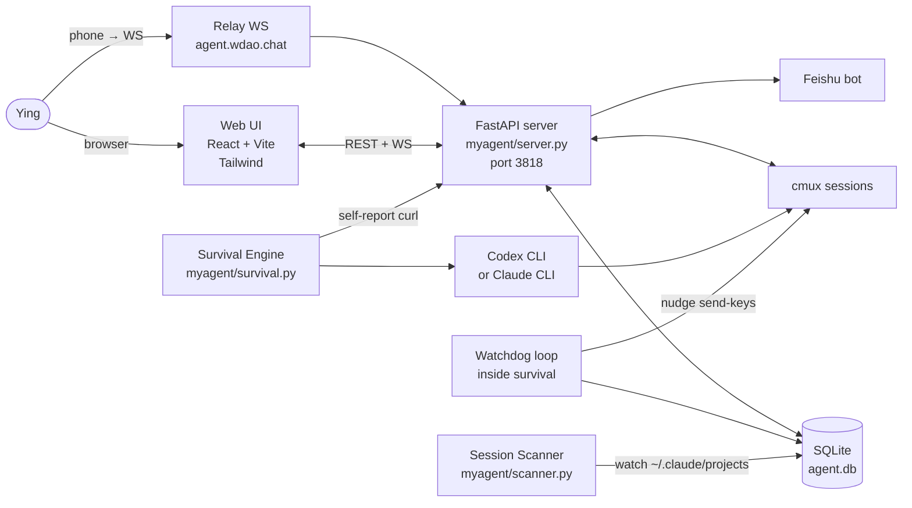
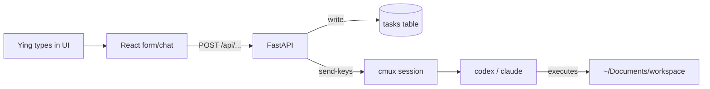
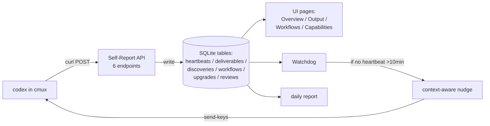

# MyAgent Architecture

> One-page system map. For detailed design see `docs/OVERVIEW.md`.
> For spec status see `docs/specs/SPEC_LEDGER.md`.
> For implementation progress see `docs/PROGRESS.md`.

---

## 1. What MyAgent is

MyAgent is Ying's **personal AI control plane**: a long-running digital employee plus a web dashboard to command it. The agent runs Claude or Codex in a persistent shell session (cmux), executes tasks autonomously, and reports status back through a Self-Report API. The UI is a commander's cockpit — not a monitor — where Ying defines what, how, and to what standard the agent works, then collects results.

Scope: single user (Ying), single Mac Studio, no multi-tenant, no mobile.

---

## 2. Vocabulary

These 5 terms are load-bearing. They appear in every spec and ADR.

| Term | Definition | Current state | Future |
|------|------------|---------------|--------|
| **Digital Human** | A long-running role instance with its own cmux session, context, and heartbeat loop | Not abstracted yet; the survival engine IS the (only) digital human | Multiple digital humans, each with distinct role (planner / executor / observer / evolver) |
| **Persona** | Identity foundation of a digital human: `identity.md` + `knowledge.md` + `principles.md`. One digital human = one persona | `persona/` directory, single set | Per-digital-human subdirectories |
| **Skill Agent** | Stateless, single-use expert role callable by any digital human (researcher / code-reviewer / frida-farm / ...) | `agents/` directory, 5 cards. Conceptually renamed "skills" — directory rename deferred | Shared library across all digital humans |
| **Survival Engine** | The autonomous execution loop running the sole digital human | `myagent/survival.py` + cmux session, provider: codex | Becomes one of several digital-human runtimes |
| **Self-Report Event Bus** | API endpoint surface (heartbeat / deliverable / discovery / workflow / upgrade / review) that digital humans write to and UI/watchdog read from | 6 endpoints planned in V2 design (§ 4 of v2 spec); partial implementation | System-level bus, tagged by digital-human ID, multi-producer/multi-consumer |

---

## 3. Process Topology

Key process facts:
- Single FastAPI server on `:3818` is the only long-running Python process (plus launchd `com.ying.myagent`)
- Cmux sessions are persistent across server restarts
- Survival engine and its watchdog are subprocesses/threads of the main server, not separate daemons
- Relay server gives phone access via a WebSocket tunnel

---

## 4. Data Flow

### Command path (human → agent)

### Report path (agent → human)

Key data facts:
- **Every agent→human signal goes through the Self-Report bus**, not through log scraping
- Watchdog reads only the bus, never `cmux capture-pane`, once bus is live
- Cmux `capture-pane` is a fallback for "bus silent" scenarios

---

## 5. Source of Truth Map

| Thing | Source of truth | Notes |
|-------|-----------------|-------|
| Backend code | `myagent/` package | 28 modules; FastAPI in `server.py`, routes in `router.py` |
| Frontend code | `web/src/` | 18 pages under `web/src/pages/` |
| Runtime config | `config.yaml` | Single file; Postgres flag is legacy, will be removed (see storage ADR) |
| Persistent data | `agent.db` (SQLite) | Single DB; Postgres exists in config but is not the source of truth (see `docs/decisions/2026-04-24-storage.md`) |
| Persona content | `persona/*.md` | identity / knowledge / principles |
| Skill agent cards | `agents/*.md` | 5 cards; conceptually "skills", rename pending |
| Spec master | `docs/OVERVIEW.md` | Merged V2 design. Old specs under `docs/specs/2026-03-*` are Superseded |
| Spec index | `docs/specs/SPEC_LEDGER.md` | Status of every spec file |
| Active cleanup plan | `docs/specs/plans/2026-04-24-stabilization-sprint.md` | This round |
| Decisions log | `docs/decisions/` | ADRs; 2 filed this round |
| Progress ledger | `docs/PROGRESS.md` | V2 phase completion, evidence-linked |

---

## 6. Phase map (V2)

The V2 redesign has 5 phases. Live status is in `docs/PROGRESS.md`. Summary:

1. Tailwind + icon sidebar + dark/light
2. Rewrite existing pages (Overview, Chat, Sessions, Engine, Tasks, Memory)
3. Self-Report API (6 endpoints + DB tables + prompt wiring)
4. Three new pages (Output, Workflows, Capabilities)
5. Integration (watchdog on bus, context-aware nudges, semantic Feishu reports, context-aware restart)

---

## 7. Constraints

- **Only one user.** No auth ACL beyond owner/self.
- **Only one machine.** No distributed consistency concerns.
- **Git rule: every meaningful change committed AND pushed to `xmqywx/Evolve`.** Unpushed = doesn't exist.
- **Never `pkill -f`.** Killed the Mac twice. Use PID-tracking (`scripts/install.sh` pattern).
- **cmux, not tmux.** The rest of the codebase may still contain tmux references — see `docs/PROGRESS.md` catalog.
- **Codex is the default provider** (`config.yaml: survival.provider: codex`). Claude support remains.

---

## 8. Where to go next

- New feature request → first check `docs/OVERVIEW.md`, then file an ADR if a boundary is crossed
- Bug/incident → check `docs/PROGRESS.md` for what's actually implemented
- "Where does X live?" → see § 5 table above
- "What does X mean?" → see § 2 vocabulary

---

_Last updated: 2026-04-24 (stabilization sprint step 1)_
